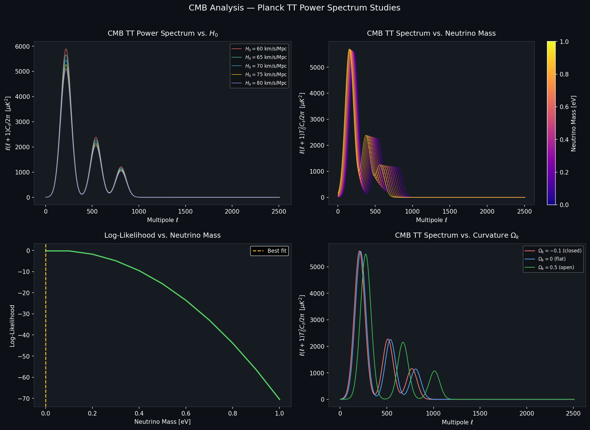
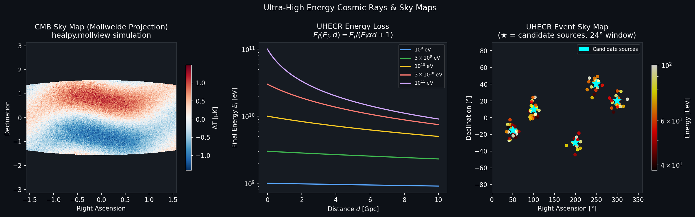

# Cosmology & Ultra-High Energy Cosmic Ray Research

> A collection of computational notebooks and Mathematica analyses exploring the CMB power spectrum, cosmological parameter constraints, and the origin of ultra-high energy cosmic rays (UHECRs).

---

## 📁 Repository Structure

```
├── Thesis.ipynb          # Log-likelihood analysis of CMB data (h, Ω_k)
├── amnh.ipynb            # AMNH project: neutrino mass constraints from Planck
├── cosmo_proj.ipynb      # Hubble constant H₀ variation + HEALPix sky maps
├── summer_proj.ipynb     # Summer project: H₀ multi-spectrum plotting
├── energyloss.nb         # Mathematica: UHECR energy loss model
├── mathematica.nb        # Mathematica: UHECR anisotropy & likelihood analysis
└── skymap.nb             # Mathematica: Mollweide sky map generation
```

---

##  Project Overview

This research spans two major themes in high-energy astrophysics:

### 1. CMB Power Spectrum Analysis
Using [`CLASS`](https://github.com/lesgourg/class_public) (Cosmic Linear Anisotropy Solving System) to compute theoretical CMB temperature–temperature (TT) power spectra $D_\ell = \frac{\ell(\ell+1)}{2\pi} T_0^2 C_\ell$, and comparing them to **Planck satellite** observations via log-likelihood analysis.

### 2. Ultra-High Energy Cosmic Ray (UHECR) Anisotropy
Mathematica notebooks implement a full pipeline for testing whether the arrival directions of UHECRs above an energy threshold (38 EeV) are correlated with known astrophysical source catalogs, using angular window functions and a maximum-likelihood formalism.

---

## Plots & Results

### CMB Power Spectrum Studies



**Top-left:** The TT power spectrum $D_\ell$ computed for five values of the Hubble constant $H_0 \in [60, 80]$ km/s/Mpc. Lower $H_0$ shifts acoustic peaks and changes the overall amplitude.

**Top-right:** Effect of varying neutrino mass $m_\nu \in [0, 1.0]$ eV. Increasing neutrino mass suppresses small-scale power and damps higher acoustic peaks.

**Bottom-left:** Log-likelihood curve as a function of neutrino mass, comparing theory spectra to Planck TT data. The peak gives the best-fit $m_\nu$.

**Bottom-right:** Curvature dependence — open ($\Omega_k > 0$), flat ($\Omega_k = 0$), and closed ($\Omega_k < 0$) universes shift the angular position of acoustic peaks.

---

### UHECR Energy Loss & Sky Maps



**Left:** Simulated CMB sky map in Mollweide projection as generated by `healpy.mollview` from `cosmo_proj.ipynb`. The spherical harmonic synthesis uses `healpy.synfast` with $N_\text{side} = 2^{10}$.

**Center:** Energy loss model from `energyloss.nb`. The final energy of a UHECR after traveling distance $d$ is:
$$E_f(E_i, d) = \frac{E_i}{E_i \alpha d + 1}, \quad \alpha = 10^{-11} \text{ Mpc}^{-1}$$
plotted for initial energies $E_i \in [10^9, 10^{11}]$ eV on a log scale.

**Right:** UHECR arrival direction sky map from `skymap.nb`. Events above 38 EeV are shown in equatorial coordinates (RA, Dec), color-coded by energy. Cyan stars mark candidate source positions tested for angular correlation within a $\Delta = 24°$ window.

---

##  Methods

### CMB Notebooks (Python / CLASS)

| Notebook | Key Analysis | Parameter Varied |
|---|---|---|
| `summer_proj.ipynb` | H₀ comparison plot | $H_0 = 60$–$80$ km/s/Mpc |
| `cosmo_proj.ipynb` | H₀ + HEALPix maps + χ² | $H_0$, $\Omega_k$ |
| `amnh.ipynb` | Neutrino mass constraints | $m_\nu \in [0, 1.0]$ eV |
| `Thesis.ipynb` | Full log-likelihood scan | $h$, $\Omega_k$, $\Lambda$ |

**Log-likelihood definition:**
$$\ln \mathcal{L} = -\frac{1}{2} \sum_\ell \left(\frac{D_\ell^\text{theory} - D_\ell^\text{obs}}{\sigma_\ell}\right)^2$$

where $\sigma_\ell = (\sigma^+ + \sigma^-)/2$ are averaged Planck uncertainties.

### UHECR Notebooks (Mathematica)

| Notebook | Key Analysis |
|---|---|
| `energyloss.nb` | Energy attenuation model $E_f(E_i, d)$ via `LogPlot` |
| `mathematica.nb` | Angular correlation likelihood, source catalog matching |
| `skymap.nb` | Mollweide projection, kernel density estimation, parallelized sky maps |

**Angular separation** between two sky positions is computed via:
$$\delta(\text{RA}_1, \text{Dec}_1, \text{RA}_2, \text{Dec}_2) = \arccos(\hat{n}_1 \cdot \hat{n}_2)$$

**Probability density function** for UHECR energies (truncated power law with exponential cutoff):
$$f(E; \gamma, E_c) = E_c^{\gamma-1} E^{-\gamma} \frac{e^{-E/E_c}}{\Gamma(1-\gamma,\, E_\text{th}/E_c)}$$

---

##  Dependencies

### Python (Jupyter Notebooks)
```bash
pip install numpy scipy matplotlib healpy classy
```

| Package | Purpose |
|---|---|
| `classy` | CLASS Boltzmann solver for CMB spectra |
| `healpy` | HEALPix pixelization & sky maps |
| `numpy` / `scipy` | Numerical computation |
| `matplotlib` | Plotting |

### Mathematica
- Mathematica 13.0 / 13.2
- `MaTeX` package (LaTeX-formatted labels)
- Parallel kernel support (`LaunchKernels[8]`)

---

##  Data Files Required

| File | Description |
|---|---|
| `planck-tt.txt` | Planck 2018 TT power spectrum + uncertainties |
| `data.txt` | UHECR event catalog (energy, RA, Dec columns 6–8) |
| `sources.txt` | Candidate astrophysical source catalog |
| `out001XX_cl.dat` | CLASS output $C_\ell$ files for $H_0 \in \{60,...,80\}$ |

---

##  Notes

- CMB temperature today: $T_0 = 2.7255 \times 10^6\,\mu\text{K}$ (used to normalize $D_\ell$)
- Planck data range: $\ell = 2$ to $\ell_\text{max} = 2508$
- UHECR energy threshold: $E_\text{th} = 38$ EeV
- Angular correlation window: $\Delta = 24°$
- HEALPix resolution: $N_\text{side} = 2^{10}$ ($\sim 0.06°$/pixel)

---

##  Author

**Neena Noble**  
Research in cosmology and ultra-high energy cosmic ray physics.
